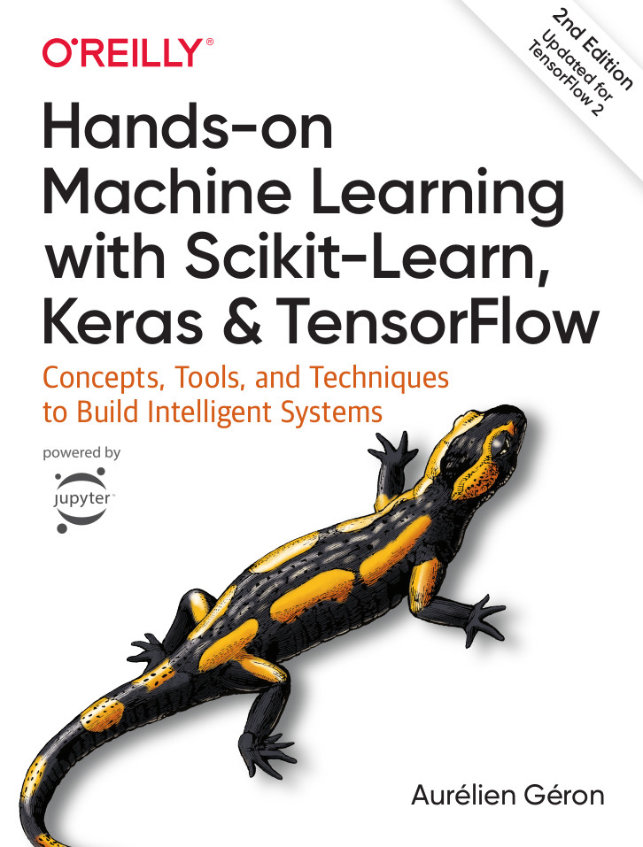

#  HANDS-ON MACHINE LEARNING WITH SCIKIT-LEARN, KERAS & TENSORFLOW Companion



This is the most comprehensive hands-on book about machine learning (ML) in the market at the moment. This is my notes about the book including mathematical exposition. Only the first part *The Fundamentals of Machine Learning* is covered in this post.

To my thinking, one distinction needs to be emphasized about ML, before diving deeper, is the uniqueness of "Learning" part. Since biological and silicon based entities are different in terms of underlying *hardware*, learning task of a machine must be considered regarding the limits of computing mechanism. This caveat is important to curb overreaching analogies between biological and machine based learning systems. This trend also poisoned nature inspired heuristics research filed which produced bizarre optimization algorithm such as "Sloth like lazy computing for backtracking grot tree data structures".

> So may your bias and variance be low:

```python
A Fictituous Universal Learning Language Pseudocode
agent1 = agent(semi_intelligent)  No T-1000's!
something = task()
agent1.learn(something)
agent1.do(something)  hopefully successfully
```

**P.S.** Throughout the text, there are tidbits titled as **Remark** which indicates information or interpretation independent of the book. Therefore they should be evaluated as such. In other words, they are not canon, so don't go retconning on me and snitch me to Aurelien Geron.

 # Contents

- [1. The Machine Learning Landscape]()
- [2. End-to-end Machine Learning Project]()
- [3. Classification]()
- [4. Training Models]()
- [5. Support Vector Machines]()
- [6. Decision Trees]()
- [7. Ensemble Learning and Random Forests]()
- [8. Dimensionality Reduction]()
- [9. Unsupervised Learning Techniques]()