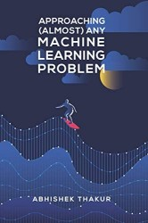

*by Abhishek Thakur*

This is a lovely recipe book for ML enthusiasts by a kaggle champion. Regardless, author has left many nuances
unexplained and encourage the reader (or in this case coder) to work out herself. This is my **companion** to fill in
the blanks and clarify certain aspects. However, one should be wary of the fact that you only learn doing and struggling. So these notes are largely **personal** and somewhat biased towards my knowledge gaps. Use them at your own peril. And now for something completely
different...

# Setup
First thing first, for the future poor souls trying to code along with this book and using the official repository
(accessed on **03.02.2021**) [environment.yml]( https://github.com/abhishekkrthakur/approachingalmost ) for setting up
their virtual environment, you are in a world of pain. It is a mess and full of dependency issues. In addition, this
requires `make` program. So here's what you should do:

**Note:** Please use conda, you are not ready for the jungle war aptly named as python environment management:

1. First modify the requirement.txt file as follows:

```bash
gast: from 0.3.3 to 0.2.2
numpy: from 1.19.0 to 1.18.5
tensorboard: from 2.2.2 to 1.15.0
tensorflow: from 2.2.1 to 1.15.0 #Book uses 1.15 I don't know why v2 is given
tensorflow-estimator: from 2.2.0 to 1.15.1
```

2. If you already have tried to create an environment and failed to do so (assuming the name of your virtual environment
is "aaamlp" otherwise modify `Makefile`) run the following command (if not skip this):

```bash
$ make clean # This might break other environments, so do it at your own peril
```

3. Now that you have cleaned previous installments or already starting clean, run the following command to install.

```bash
$ make install
```
# Datasets

Since datasets are huge in the eye of github, they are not included in this repository. However, there are symbolic
links (sorry Windows) to datasets inside project `input` directories.

An archive including all the datasets can be found in [here](https://www.kaggle.com/abhishek/aaamlp/). Just extract
everything inside datasets folder without changing any name, you are good to go. Content of data folder is :

    adult.csv
    adult_folds.csv
    catinthedat_test.csv
    catinthedat_train.csv
    catinthedat_train_folds.csv
    cat_test.csv
    cat_train.csv
    cat_train_folds.csv
    imdb.csv
    imdb_folds.csv
    mnist_test.csv
    mnist_train.csv
    mnist_train_folds.csv
    mobile_train.csv
    openml
    pneumothorax.csv
    winequality-red.csv

Another way to use `make get_data` to obtain datasets. First, go to your kaggle account tab and create a kaggle API
token which is the `kaggle.json` file. Place that file in your `~/.kaggle` directory. Run the following command in your
conda environment

```bash
$ make get_data
```

Some helpful functions are coded to `utilities.py` file and imported from there since we have a single jupyter notebook
for each chapter and there are some common functions. It's possible to add new functions to the file, however one should
note that running the cell including `import` statements does NOT reloads the modules or files. Therefore, to reload the
`utilities.py` file after making changes, following code should be added:

```python
import importlib
import utilities
importlib.reload(utilities)
```

# Chapters


