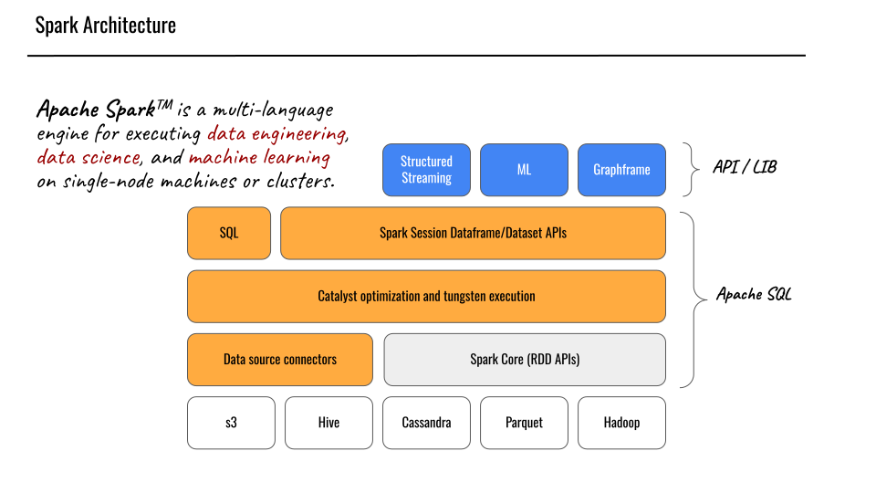
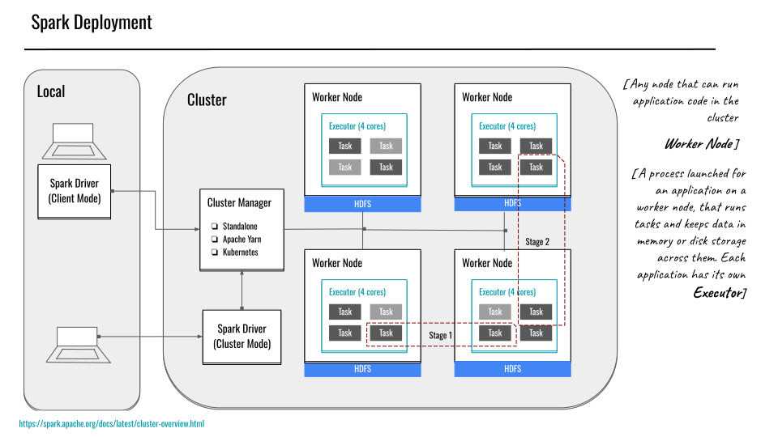

# APACHE SPARK

Apache Spark™ is a multi-language engine for executing data engineering, data science, and machine learning on single-node machines or clusters. 

Early two thousands started to generate a lot of data that need to be processed in batch or real time. Since this was before the cloud revolution, only big firms with access to large on-prem machines could work with this data. In order to utilize consumer hardware in a distributed manner Apache Hadoop is invented! The main bottleneck was that operations are written to disks. 

# Architecture

Apach Spark utilizes operations using memory and storage independent approach. For storage:
- Hadoop distributed file system (HDFS)
- Cassandra
- Parquet
- AWS s3 or any other distributed object storage system

This approach decouples storage and computing with Hadoop distributed file system and mapreduce. 

Apache Spark's main data structure is Resilient Distributed Data (RDD) and first API was based on this. Modern API is based on Dataframe and Dataset. Dataset is typed version of Dataframe. Scala/Java can only use strongly typed Dataset API and python can only use DataFrame. 

# Deployment Modes 

| Mode | Spark Driver | Spark Executor | Cluster Manager |
|  --- |  --- |  --- |  --- |
| **Local** | Runs on a single JVM (e.g., laptop/single node) | Runs on the same JVM as the driver | Runs on the same host |
| **Standalone** | Can run on any node in the cluster | Each node in the cluster launches its own executor JVM | Spark Standalone Manager (allocated to any host in the cluster) |
| **YARN (client)** | Runs on a client machine (not part of the YARN cluster) | Runs in YARN NodeManager containers | YARN Resource Manager + Application Master (allocates containers on NodeManagers for executors) |
| **YARN (cluster)** | Runs alongside the YARN Application Master (within the YARN cluster) | Same as YARN client mode (NodeManager containers) | Same as YARN client mode |
| **Kubernetes** | Runs in a Kubernetes pod | Each worker runs in its own Kubernetes pod | Kubernetes Master (manages pod scheduling and resource allocation) |

When spark driver runs in local for client deployment mode, large amount of data need to be transfered. For this reason, cluster mode is more preferable.  

